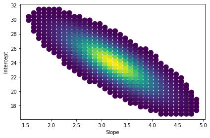

# Bayesian Regression

Python implementation for Bayesian regression using pre-defined parameter space and informative priors. 

Inspired by:
https://github.com/egorhowell/Medium-Articles/blob/main/Statistics/Bayesian_Regression.ipynb

Bayesian vs MLE

Posterior distribution for parameters

