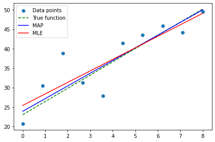
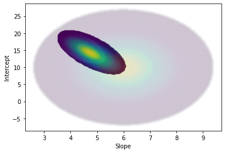
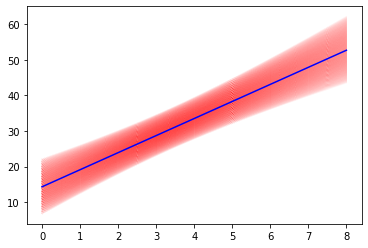

# Bayesian Regression

Python implementation for Bayesian regression using pre-defined parameter space and informative priors. 

<<<<<<< HEAD
Note! __Increasing number of parameters, parameter resolution and/or number of data points will rapidly cause memory problems.
=======
Note! - Increasing number of parameters, parameter resolution and/or number of data points will rapidly cause memory problems.
>>>>>>> 303aa4f47c7621749c20636143054d4ba9ba34a9
Array size =  (parameter resolution)^(number of parameters) * (number of data points) * (5 columns).
With 4 parameters, 80 values per parameter and 10 datapoints will reserve about 40gb of RAM.

Inspired by:
https://github.com/egorhowell/Medium-Articles/blob/main/Statistics/Bayesian_Regression.ipynb

Bayesian vs MLE

Posterior distribution on prior distribution for parameters

Posterior distribution for regression line

